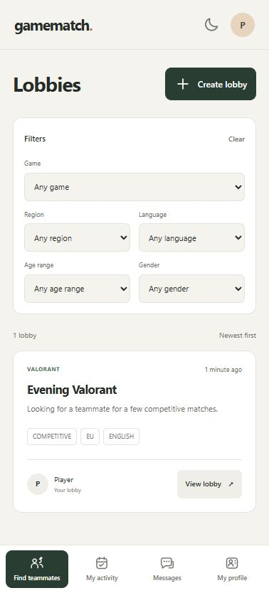

# Interface

The interface uses a warm neutral background, green actions and local SVG icons. Discord, Steam and Riot use brand paths from Simple Icons. Navigation becomes a bottom bar on mobile. Light and dark themes are available.

Pages use short headings, functional labels and error messages. Lobbies show the game, preferences, host and description without promotional artwork or banners.

The initial layout reference was the [MotionSites community app](https://motionsites.ai/?prompt=social-hangouts). No template code was copied.
