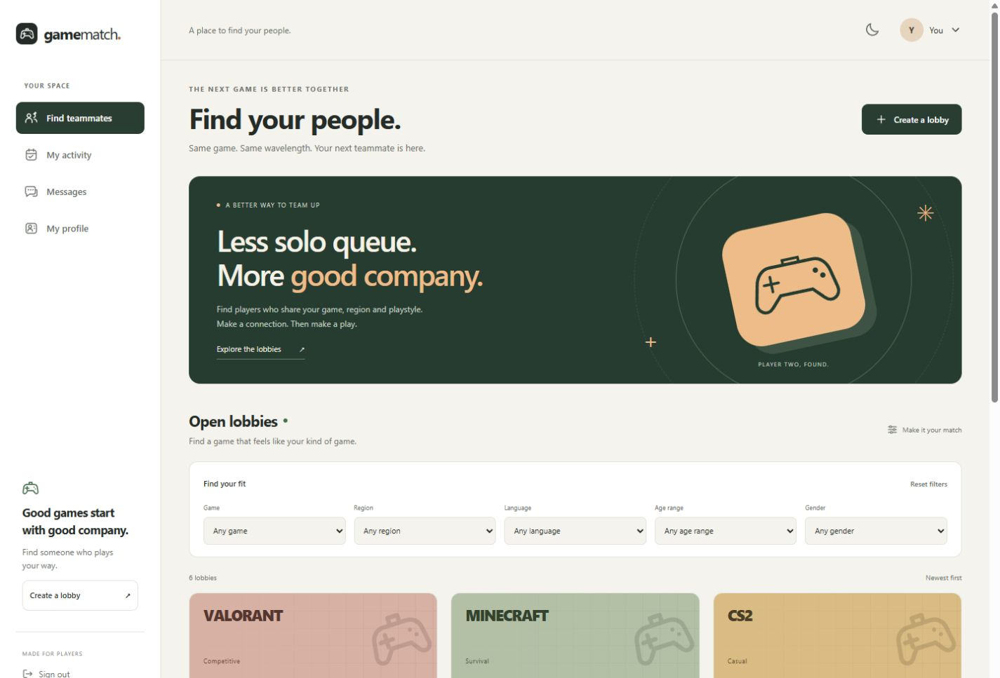
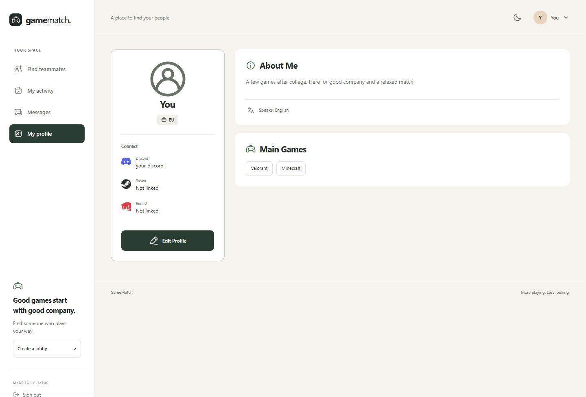

# Interface design

The visual direction was inspired by the Community App reference at [MotionSites](https://motionsites.ai/?prompt=social-hangouts): an easy-to-scan sidebar, a focused feed and clear navigation. No template code or paid prompt was copied.

GameMatch uses a warm neutral background, forest green actions and amber highlights. A shared local SVG component supplies interface icons. Discord, Steam and Riot use their brand paths from Simple Icons. Cards use CSS artwork, and the controller illustration and navigation icons are repository-native SVGs. The layout adapts to a mobile bottom navigation bar and supports a dark theme.

